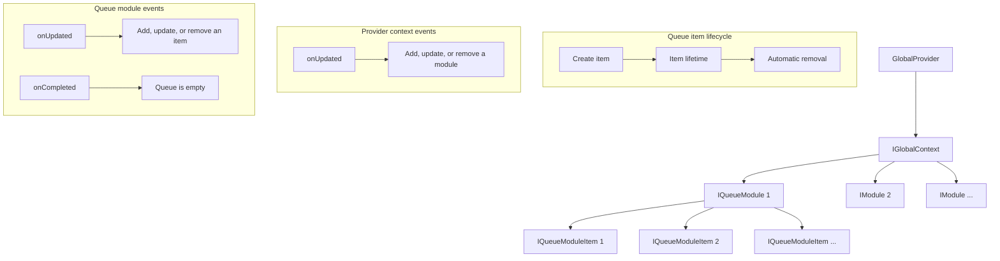

# GlobalProvider

## Core
The root provider for components that share global state.

## Context API

GlobalProvider exposes a context for managing shared modules and their items.

### Main interfaces

- `IGlobalContext` - the context for managing modules
- `IQueueModule` - a module for managing a queue of items
- `IQueueModuleItem` - an item in a queue module

### Consume the context

```typescript
// Consume the provider context
import { consume } from '@lit/context';
import { LitElement } from 'lit';
import { globalContextCreated, type IGlobalContext } from './context';

class YourComponent extends LitElement {
  @consume({ context: globalContextCreated })
  private globalContext?: IGlobalContext;
}
```

### Manage modules

These examples run within this component directory and assume an available `globalContext`. Import `QueueModule` from `./context` when creating queue modules.

```typescript
// Add or update a module
const module = globalContext.putModule(
  new QueueModule({ id: 'moduleId' })
);

// Get an existing module
const existingModule = globalContext.getModule('moduleId');

// Get all modules
const allModules = globalContext.getModules();

// Remove a module
globalContext.removeModule('moduleId');

// Subscribe to module updates
globalContext.onUpdated((module) => {
  console.log('Module updated:', module);
});
```

### Use QueueModule

```typescript
// Create a QueueModule
const module = new QueueModule({
  id: 'moduleId',  // required module identifier
  defaultDelay: 0, // default item lifetime in milliseconds; a value of 0 or less disables automatic removal
});
globalContext.putModule(module);

// Add or update a queue item
const item = module.putItem(
  {
    id: 'itemId', // required item identifier
    // additional properties
  },
  0,  // optional item lifetime in milliseconds
);

// Get an item
const existingItem = module.getItem('itemId');

// Get all items
const allItems = module.getItems();

// Remove an item
const removedItemId = module.removeItem('itemId');

// Clear the queue
module.clearAll();

// Subscribe to item updates
module.onUpdated((item) => {
  console.log('Item updated:', item);
});

// Subscribe to queue completion
module.onCompleted(() => {
  console.log('Queue is empty');
});
```

### Behavior

- Items can be removed automatically after `defaultDelay` milliseconds, or after the delay passed to `putItem`.
- Modules provide subscriptions for updates and queue completion.
- The `globalContext.modules` collection rejects direct writes and deletions. Use `putModule` to add or update a module and `removeModule` to remove it.
- The `QueueModule.queue` collection rejects direct writes and deletions. Use `putItem`, `removeItem`, or `clearAll` to change it.

## GlobalProvider flow



