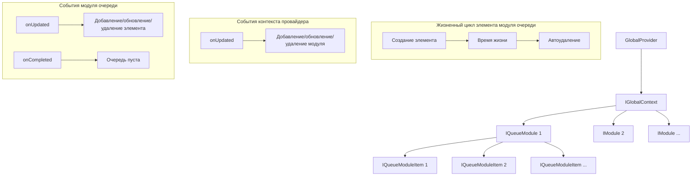

# GlobalProvider

## Core
Корневой компонент для всех компонентов, которые используют глобальные данные.

## Context API

GlobalProvider предоставляет контекст для управления глобальными модулями и их элементами.

### Основные интерфейсы

- `IGlobalContext` - главный контекст для управления модулями
- `IQueueModule` - модуль для управления очередью элементов
- `IQueueModuleItem` - элемент очереди модуля

### Использование контекста

```typescript
// Получение контекста
import { consume } from '@lit/context';
import { globalContextCreated } from './context';

class YourComponent extends LitElement {
  @consume({ context: globalContextCreated })
  private globalContext?: IGlobalContext;
}
```

### Работа с модулями

```typescript
// Добавление или обновление модуля
const module = globalContext.putModule({
  id: 'moduleId',
  // дополнительные свойства
});

// Получение существующего модуля
const existingModule = globalContext.getModule('moduleId');

// Получение всех модулей
const allModules = globalContext.getModules();

// Удаление модуля
globalContext.removeModule('moduleId');

// Подписка на обновления модулей
globalContext.onUpdated((module) => {
  console.log('Module updated:', module);
});
```

### Работа с модулем QueueModule

```typescript
// Добавление модуля QueueModule
const module = globalContext.putModule(
  new QueueModule({
    id: 'moduleId',  // обязательное поле, идентификатор модуля
    defaultDelay: 0, // опциональное поле, задержка по умолчанию для элементов, по умолчанию 0, если меньше или равно 0, счетчик для удаления элемента не будет запущен
  })
);

// Добавление/обновление элемента в очереди модуля
const item = module.putItem(
  {
    id: 'itemId', // обязательное поле, идентификатор элемента
    timeout: 0, // поле будет создано если указан второй аргумент putItem, задержка удаления элемента, по умолчанию 0, если меньше или равно 0, счетчик для удаления элемента не будет запущен
    // дополнительные свойства
  },
  0,  // опциональная задержка удаления
);

// Получение элемента
const item = module.getItem('itemId');

// Получение всех элементов
const allItems = module.getItems();

// Удаление элемента
const removedItemId = module.removeItem('itemId');

// Очистка очереди модуля
module.clearAll();

// Подписка на обновления элементов
module.onUpdated((item) => {
  console.log('Item updated:', item);
});

// Подписка на завершение очереди
module.onCompleted(() => {
  console.log('Queue is empty');
});
```

### Особенности
- Элементы могут быть автоматически удалены после указанного времени (defaultDelay)
- Модули поддерживают систему подписок на обновления и завершение очереди
- modules в globalContext иммутабельны, для добавления/обновления модуля используется putModule, для удаления модуля используется removeModule
- queue в QueueModule иммутабельны, для добавления/обновления элемента используется putItem, для удаления элемента используется removeItem

## Блок-схема работы GlobalProvider



